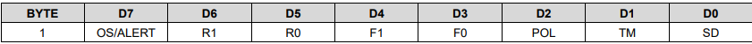
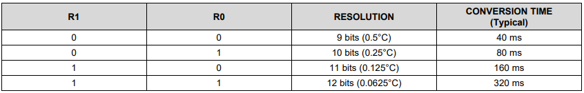
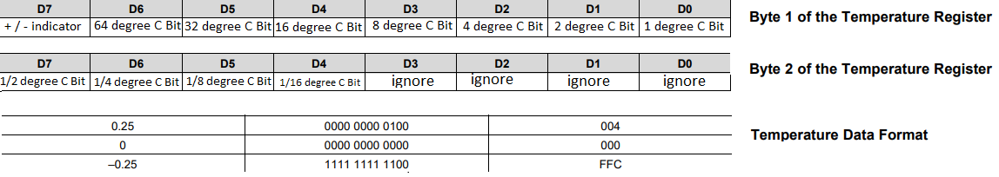

# EFM32Core
This project serves as a library for the EFM32 Zero Gecko microcontroller 

---
## Authors [@MeritonAliu](https://github.com/MeritonAliu)
---
## Installing & Usage
1. Copy the inc and src folders into the project folder.
2. Copy em_timer.c from C:\Users\USERNAME\SimplicityStudio\SDKs\gecko_sdk\platform\emlib\src\em_timer.c
   to gecko/platform/emlib/src 
3. Under [PROJECTNAME]_project.slcp -> software components you have to install: GLIB Graphics Library, GLIB driver for SHARP Memory LCD, I2C, TIMER

---
## Information of the core library files

### GPIO
The two LEDS can be initialized with the functions gpioInitLEDS() and set with gpioSetLedOff(), gpioSetLedOn(), gpioToggleLed(). 

To initialize the pushbuttons as normal inputs use gpioInitInput() 
To initialize the pushbuttons as interrupt inputs use gpioInitInterruptPB1() / gpioInitInterruptPB1() 

If the pushbuttons are used as interrupts, you can write the interrupt handler code on src/GPIO.h in the GPIO_ODD_IRQHandler() and GPIO_EVEN_IRQHandler)(). 
It depends if the pin is even or odd.

You can use the variables myevengpioflag and myoddgpioflag in your app.c file.
These variables are set to one if the button is pressed, but dont reset to zero.


### Display
The onboard display of the EFM32 Zero Gecko has to be initialized first, use displayInit() for it.
Use displayClear() to clear the whole screen.
Use displayWriteTextLine(text, line) or displayWriteTextXY(text, x, y) to write text on the screen.

### Timer
The EFM32ZG has two timers, the TIMER0 and TIMER1. 
Use timer0Init500ms() and timer1Init1ms() to initializes the two timers with the named time.

Feel free to create an own timer function, [you can also check out my inspiration](https://github.com/SiliconLabs/peripheral_examples/blob/master/series0/timer/timer_single_pulse_generation_interrupt/src/main_g.c) 
Time can be set with the prescaler and tge toptime.
The lower the prescaler is, the higher is the resolution and the energy consumption. 

Your timer code can be either written directly in the interrupt handler at src/Timer.c into the functions TIMER0_IRQHandler() and TIMER1_IRQHandler.

Or you could use the variables mytimer0flag and mytimer1flag which are set to oine every cycle, but dont reset to zero.

### I2C
To initialize I2C use I2CInit() 
To read and write with I2C, you can use the following functions:
- I2CRead(uint8_t address, uint8_t *dataread, uint16_t lenread);
- I2CWrite(uint8_t address, uint8_t *datawrite, uint16_t lenwrite);
- I2CWriteRead(uint8_t address, uint8_t *datawrite, uint16_t lenwrite, uint8_t *dataread, uint16_t lenread);
```c
//write and read function
I2C_TransferReturn_TypeDef I2CWriteRead(uint8_t address, uint8_t *datawrite, uint16_t lenwrite, uint8_t *dataread, uint16_t lenread){
  I2C_TransferReturn_TypeDef I2C_Status;
  I2C_TransferSeq_TypeDef seq;

  seq.addr = address;
  seq.flags = I2C_FLAG_WRITE_READ;
  seq.buf[0].data = &datawrite[0];
  seq.buf[0].len = lenwrite;
  seq.buf[1].data = &dataread[0];
  seq.buf[1].len = lenread;
  I2C_Status = I2C_TransferInit(I2C0, &seq);

  while (I2C_Status == i2cTransferInProgress)
  {
      I2C_Status = I2C_Transfer(I2C0);
  }
  return I2C_Status;
}
```

### TMP100 
To show the Temperature of the TMP100, you can use Tmp100ShowTemperature(uint8_t y);
To set the resolution of the TMP100, use Tmp100SetResolution(uint8_t resolution);

The pinning is: PE13 = SCL // PE12 = SDA (can be editied in the GPIO.h file).
The TMP100 has four Registers. To select one, we need to send the adress byte followed with the register byte. 

The first two bits select the register. We are only going to use the temperature register (0x00) and the configuration register (0x01). 
All other bits must be zero.


To set the resolution in which the sensor returns the temperature we must first call the config register (0x01) and change the values R0/D5 and R1/D6 in the configurations byte to the desired setting. 



If the resolution is set higher, the sensor also needs more time to send the temperature.



To read the temperature, write (0x00) to enter the temperature register, then read the 2 bytes.
The MSB or D7 of the first byte indicates whether the temperature is negative or positive, D1 to D6 indicates the value of the temperature. 
In the second byte the bits D4 to D7 are responsible to indicate the float value of the temperature, depending on the solution setting the lower significant bits are always zeros.




---
## Task list
- I2C Interrupt
- Control the VL53L1X 
- Sleep Modes?
  

---
## Usefull links
##### EFM32 Links
 - [EFM32 Zero Gecko](https://www.silabs.com/development-tools/mcu/32-bit/efm32zg-starter-kit)
 - [EFM32ZG Data Sheet](https://www.silabs.com/documents/public/data-sheets/efm32zg-datasheet.pdf)
 - [EFM32ZG Reference Manual](https://www.silabs.com/documents/public/reference-manuals/EFM32ZG-RM.pdf)
 - [EFM32ZG User Manual](https://www.silabs.com/documents/public/user-guides/efm32zg-stk3200-ug.pdf)
##### EFM32 Links
 - [Simplcity Studio 5](https://www.silabs.com/developers/simplicity-studio)
 - [Technical resource search](https://www.silabs.com/support/resources.p-microcontrollers_32-bit-mcus.sort=0,asc?)
 - [Software documentation](https://docs.silabs.com/mcu/5.6/efm32g/)
 - [Code examples 1](https://github.com/SiliconLabs/peripheral_examples/tree/master/series0)
 - [Code examples 2](https://github.com/SiliconLabs/peripheral_examples/tree/master/series0)
 ##### datasheet sensor
 - [TMP100 Datasheet](https://www.ti.com/lit/ds/symlink/tmp100.pdf?ts=1648622263906&ref_url=https%253A%252F%252Fwww.google.com%252F)
  ##### application notes
 - [AN0009: Getting started](https://www.silabs.com/documents/public/application-notes/an0009.0-efm32-ezr32-series-0-getting-started.pdf)
 - [AN0011: I2C master and slave operation](https://www.silabs.com/documents/public/application-notes/AN0011.pdf)
 - [AN0039: Interrupt handling](https://www.silabs.com/documents/public/application-notes/AN0039.pdf)
 - [AN0014: Timers](https://www.silabs.com/documents/public/application-notes/AN0014.pdf)
 - [AN0012: General purpose input output](https://www.silabs.com/documents/public/application-notes/an0012-efm32-gpio.pdf)
 - [AN0822: Simplicity Studio™ User's Guide](https://www.silabs.com/documents/public/application-notes/AN0822-simplicity-studio-user-guide.pdf)

